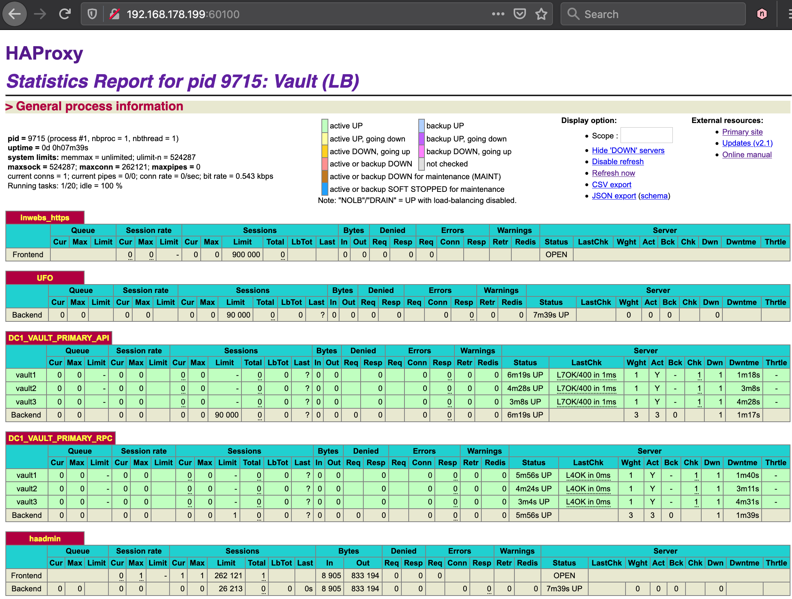

# Vault & HAProxy Health Checks

A draft and mocked demo of HAProxy backend setup with API health checks for Vault with per node (fqdn / dns) based routing as well monitored (but not externally) RPC connections that are via LAN and being internal routed.

**PS** - adjust resources (cpu & ram) detailed in `Vagrantfile` if things are a bit too slow.

## Makeup & Concept

When launched - URLs & IPs include:
 - HAProxy via **name**: [http://vault.tld.local:60100/](http://vault.tld.local:60100/) - OR **direct** - [http://192.168.178.199:60100](http://192.168.178.199:60100)
 - Vault UI via **LB**: [http://vault.tld.local](http://vault.tld.local:60100/) - OR **direct w/o LB** [http://192.168.178.176:8200](http://192.168.178.176:8200) 

Review HAProxy configuration & observer the HAProxy Stats page while performing some destructive actions to one of the Vault nodes.




```
          🌍 VAULT_USER
      💻--||--     WAN / INTERNET
  ...    / \  ... ▒
  ________________▒___________________________
     API (80,443)  ╲       RPC (disabled)
                    ╲    ╲     monitoring only 
                      ╔╦══════════════╦.199
                      ║ load-balancer  ║
      backend         ║   (haproxy)    ║
  ,=============.     ╚╩══════════════╩╝
  |   servers   |             ║
  |.-----------.|             ▼
  || v1 v2 v3  || ◄ ════ ◄ ═══╝
  |'-----------'|
  |||||||||||||||.176, .175, .174, ...
  |=============|- LAN: RPC & API / 8200+8201
   v1 = vault1, etc...
```


## Quick setup

```bash
# // ON YOUR LOCAL-MACHINE - add LB HOST / Vault entries via LB
printf "192.168.178.199 vault.tld.local\n192.168.178.199 vault1.tld.local\n192.168.178.199 vault2.tld.local\n192.168.178.199 vault3.tld.local\n" | sudo tee -a /etc/hosts ;

vagrant up ;

# // open HAProxy stats page linked earlier & observe while performing:

vagrant ssh dc1-vault2 ;

# vagrant@haproxy:~$ \
sudo service vault stop && exit ;

# // locally perform:
curl -v vault.tld.local ;  # // still works as expected
curl -v vault2.tld.local ;  # // and you can still target the bad node

# // when done delete VM's & boxes:
vagrant destroy -f haproxy dc1-vault1 dc1-vault2 dc1-vault3
vagrant box remove -f debian/buster64 --provider virtualbox ; # ... delete box images
```


## Notes
RPC routing via HAProxy has been intentionally left out and if you're wanting to complete this then consider seperated listener / backends per node bound by their DNS equivalent so as to properly direct to targetted hosts that may otherwise not be possible when dealing with TCP/IP connections.

------
